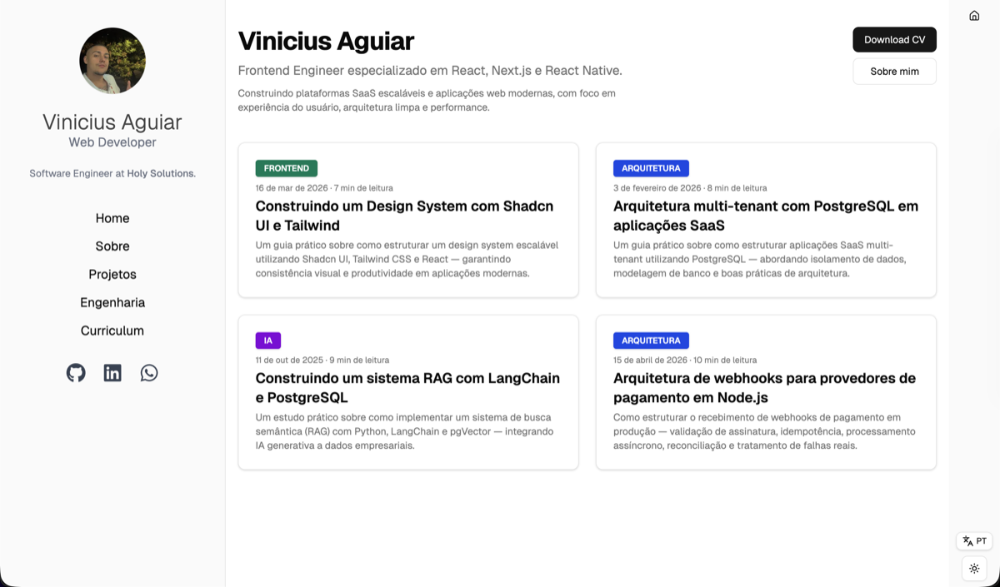

# viniciusaguiar.dev

Portfolio and technical blog by **Vinicius Aguiar** — Software Engineer specializing in React, Next.js, TypeScript and Node.js.

**[viniciusaguiardev.com.br](https://viniciusaguiardev.com.br/)**



## What's inside

- **15 real-world projects** — SaaS, marketplaces, ERPs, e-commerce, health and travel platforms
- **4 technical articles** — multi-tenant architecture, webhook design for payments, RAG pipelines, design systems
- **Engineering page** — architecture decisions, trade-offs and problems solved in production
- **Trilingual** — PT-BR, English and Spanish (cookie-based i18n)
- **Dark/Light mode** — system preference with manual toggle
- **Mobile-first** — responsive layout with hamburger menu for tablets and phones

## Pages

| Route | Description |
|---|---|
| [`/`](https://viniciusaguiardev.com.br/) | Home with blog posts |
| [`/sobre`](https://viniciusaguiardev.com.br/sobre) | About, experience, tech stack |
| [`/projetos`](https://viniciusaguiardev.com.br/projetos) | Projects portfolio with modal details |
| [`/engenharia`](https://viniciusaguiardev.com.br/engenharia) | Engineering — architecture, trade-offs, FAQ |
| [`/posts/[slug]`](https://viniciusaguiardev.com.br/posts/webhook-architecture-payment-providers) | Technical blog posts |

## Tech Stack

- **Framework:** Next.js 16 (App Router, Turbopack)
- **Language:** TypeScript
- **Styling:** Tailwind CSS 4, Shadcn UI (Radix UI primitives)
- **Themes:** next-themes (light/dark/system)
- **i18n:** PT-BR / EN / ES (cookie-based, trilingual)
- **SEO:** Open Graph, Twitter Cards, JSON-LD schemas, sitemap, robots.txt, llms.txt
- **Deploy:** Vercel
- **CI:** GitHub Actions (lint, typecheck, build, AEO check 100/100)

## CI/CD

| Step | Tool | Trigger |
|---|---|---|
| Lint + Typecheck + Build | GitHub Actions | Every PR to `main` |
| AEO Check (100/100) | Custom script | Every PR to `main` |
| Preview Deploy | Vercel | Every PR |
| Production Deploy | Vercel | Merge to `main` |

## Project Structure

```
app/              # Pages and layouts (App Router)
components/       # React components
  ui/             # Shadcn UI base components
data/             # Blog posts (JSON) and projects data
hooks/            # Custom React hooks
lib/              # Utilities, i18n, post loading
scripts/          # CI scripts (AEO check)
public/           # Static assets, logos, images
```

## License

This project is licensed under the [MIT License](LICENSE).

## Author

**Vinicius Aguiar** — Software Engineer

- [Portfolio](https://viniciusaguiardev.com.br/)
- [LinkedIn](https://www.linkedin.com/in/viniciusaguiar-araujo/)
- [GitHub](https://github.com/ViniAguiar1)
