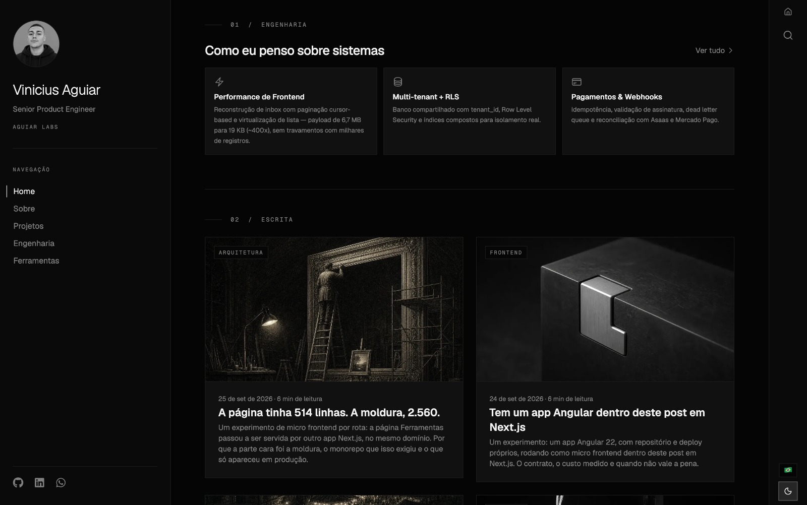

# viniciusaguiar.dev

Portfolio and technical blog by **Vinicius Aguiar** — Software Engineer specializing in React, Next.js, TypeScript and Node.js.

**[viniciusaguiardev.com.br](https://viniciusaguiardev.com.br/)**



## What's inside

- **10 projects** — SaaS platforms, e-commerce, AI tools and health systems; X-Drop, Vox Pet and iKropp have dedicated pages with case studies and real metrics
- **17 technical articles** — case studies (X-Drop, Vox Pet), multi-tenant architecture, webhook design, circuit breaker, micro frontends (Angular inside Next.js, route-based zones), frontend observability, cursor pagination, RAG pipelines, Docker, design systems, plus essays on product and career
- **Illustrated covers** — each post has its own generated cover in a consistent visual style (`pnpm blog:cover`, see [`docs/blog-covers`](docs/blog-covers))
- **Engineering page** — architecture decisions, trade-offs and problems solved in production (SaaS, multi-tenant, payments)
- **Five languages** — PT-BR, English, Spanish, Japanese and French (path-based i18n)
- **Dark/Light mode** — system preference with manual toggle
- **Mobile-first** — responsive layout with hamburger menu for tablets and phones
- **Custom 404** — animated astronaut illustration with navigation CTAs

## Pages

Every route lives under a locale prefix (`/pt`, `/en`, `/es`, `/jp`, `/fr`).

| Route | Description |
|---|---|
| [`/`](https://viniciusaguiardev.com.br/pt) | Home with engineering preview, case studies and blog posts |
| [`/sobre`](https://viniciusaguiardev.com.br/pt/sobre) | About, experience, tech stack |
| [`/projetos`](https://viniciusaguiardev.com.br/pt/projetos) | Portfolio with modal details and "Learn more" pages |
| [`/projetos/x-drop`](https://viniciusaguiardev.com.br/pt/projetos/x-drop) | X-Drop dedicated page — R$ 30k+ revenue, 100+ users, iOS app |
| [`/projetos/vox-pet-digital`](https://viniciusaguiardev.com.br/pt/projetos/vox-pet-digital) | Vox Pet dedicated page — 95 Prisma models, WhatsApp AI, NF-e |
| [`/projetos/ikropp`](https://viniciusaguiardev.com.br/pt/projetos/ikropp) | iKropp dedicated page — 50k+ users, legacy modernization |
| [`/engenharia`](https://viniciusaguiardev.com.br/pt/engenharia) | Engineering — architecture, trade-offs, FAQ |
| [`/posts/[slug]`](https://viniciusaguiardev.com.br/pt/posts/case-study-xdrop) | Technical blog posts and case studies |
| [`/busca`](https://viniciusaguiardev.com.br/pt/busca) | Search across posts and projects |
| [`/uses`](https://viniciusaguiardev.com.br/pt/uses) | Tools and setup — served by a separate Next.js app (`apps/uses`) as a micro frontend zone |

## Tech Stack

- **Framework:** Next.js 16 (App Router, Turbopack)
- **Monorepo:** pnpm workspaces + Turborepo, with `/uses` as a route-based micro frontend zone
- **Language:** TypeScript
- **Styling:** Tailwind CSS 4, Shadcn UI (Radix UI primitives)
- **Themes:** next-themes (light/dark/system)
- **i18n:** PT-BR / EN / ES / JA / FR (path-based, five locales)
- **SEO:** Open Graph, Twitter Cards, JSON-LD schemas, sitemap, robots.txt, llms.txt
- **Deploy:** Vercel
- **CI:** GitHub Actions (lint, typecheck, test, build, AEO check 100/100)

## CI/CD

| Step | Tool | Trigger |
|---|---|---|
| Lint + Typecheck + Test + Build | GitHub Actions | Every PR to `main` |
| AEO Check (100/100) | Custom script | Every PR to `main` |
| Preview Deploy | Vercel | Every PR |
| Production Deploy | Vercel | Merge to `main` |

## Project Structure

```
apps/portfolio/   # The site (Next.js App Router): pages, data, posts, scripts, public/
apps/uses/        # /uses zone — separate Next.js app, served on the same domain via rewrites
packages/i18n/    # @repo/i18n — locales, t(), dictionaries
packages/ui/      # @repo/ui — Shadcn UI, tokens, globals.css
packages/shell/   # @repo/shell — site shell (sidebars, header, footer) and zone map
packages/config/  # @repo/config — shared tsconfig and ESLint
docs/             # Guides and specs (e.g. blog covers)
```

Monorepo with pnpm workspaces and Turborepo: `pnpm build`, `pnpm test`, `pnpm lint` and `pnpm typecheck` run across every app and package.

## License

This project is licensed under the [MIT License](LICENSE).

## Author

**Vinicius Aguiar** — Software Engineer

- [Portfolio](https://viniciusaguiardev.com.br/)
- [LinkedIn](https://www.linkedin.com/in/viniciusaguiar-araujo/)
- [GitHub](https://github.com/ViniAguiar1)
