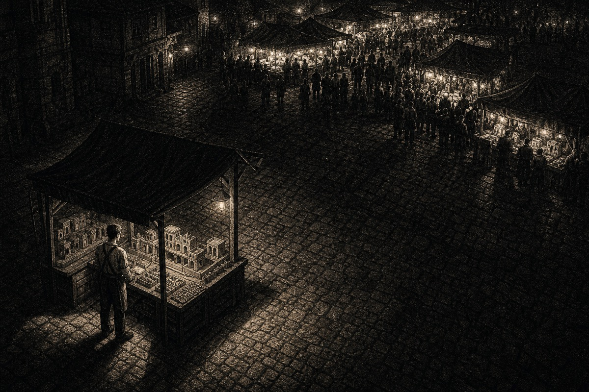
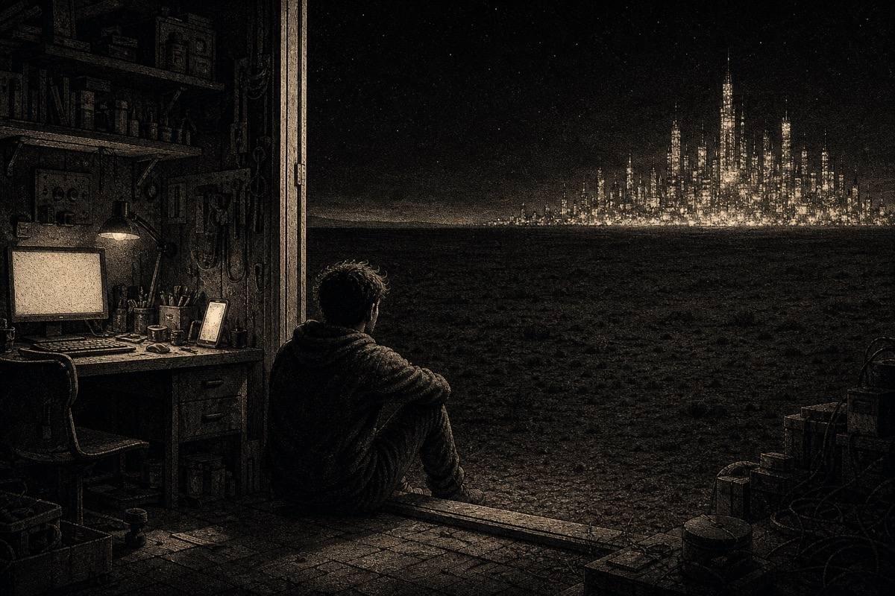
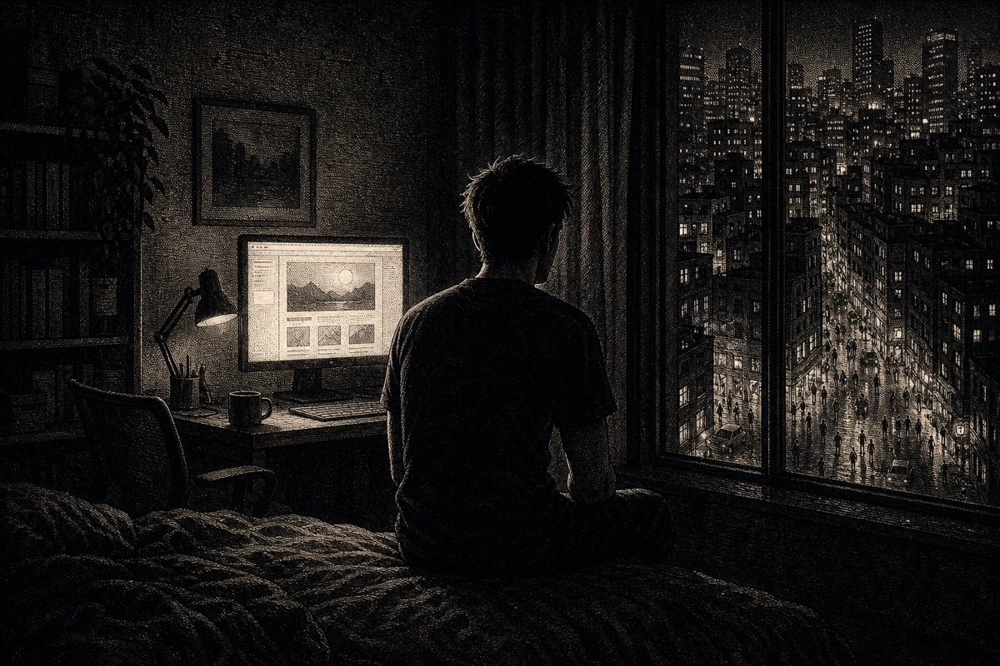

# Capas do blog

Como gerar capas com `pnpm blog:cover` e o que já funcionou. Os estilos vivem em
[`apps/portfolio/lib/blog/cover-styles.ts`](../../apps/portfolio/lib/blog/cover-styles.ts).

## Fluxo

```bash
nvm use 24
cd apps/portfolio
pnpm blog:cover <slug> --style engraving   # 3 candidatas em .covers/<slug>/ (gitignored)
pnpm blog:cover <slug> --pick 2            # vira public/blog/<slug>/{cover.webp,og.jpg}
```

O prompt é montado como `<estilo> + <coverSubject do post> + <restrições> + <paleta do estilo>`.
O `coverSubject` fica no JSON do post, em inglês, e descreve só a cena. Estilo, cor e a
regra de "sem texto" já vêm do código.

O `--pick` corta a imagem 3:2 para 16:9 (`cover.webp`) e 1200×630 (`og.jpg`), ambos
centralizados. Deixe o que importa longe das bordas de cima e de baixo.

## Estilos

| id | visual | quando usar |
| --- | --- | --- |
| `render3d` | objetos geométricos foscos, estúdio escuro | padrão; posts técnicos e conceituais |
| `halftone` | risografia abstrata, pontos grossos | alternativa abstrata |
| `engraving` | gravura pontilhada, preto e creme quente, cena com personagem | posts pessoais e narrativos, e divulgação no LinkedIn |

## `engraving`: gravura pontilhada

Nasceu na capa de [`distribution-was-the-product`](../../apps/portfolio/data/posts/distribution-was-the-product.json),
a partir de uma referência de um dev sentado num quarto escuro, olhando por uma porta aberta
para uma paisagem com lua. O creme quente nos realces é proposital: em cinza puro a gravura
perde o ar de papel impresso.

O que faz funcionar:

- **Uma metáfora, não um objeto.** A cena conta a tese do post (produto pronto, ninguém chegando).
- **Personagem de costas ou pequeno no quadro.** Dá identificação sem virar retrato.
- **Uma fonte de luz forte** e muito preto em volta.
- **Contraste de escala:** algo pequeno e isolado contra algo grande e cheio.

### Assuntos que funcionaram

**Feira**: escolhida como capa do post.



> A night market seen from a high angle: a single small immaculate stall, beautifully lit, with a young builder standing behind it seen from behind, and not a single visitor in front of it. Further down the street, large established stalls glow brightly with dense crowds gathered around them. Long shadows, empty cobblestones in the foreground

**Cidade no horizonte**



> A young developer seen from behind, sitting on the doorstep of a small cluttered home workshop at night, a desk with a glowing monitor and a phone showing a finished app behind him. Through the open doorway, a vast dark empty plain stretches out; far away on the horizon a dense, brightly lit city full of crowds and tall glowing towers. No road, no path and no footprints connect the doorstep to the city.

**Quarto e janela**



> A dark bedroom at night, a young developer seen from behind sitting on the edge of the bed, looking at a desk where a monitor glows with a finished app. The window beside the desk opens onto a vast busy city far below, thousands of lit windows, crowds in the streets, none of them looking up. The room feels isolated and silent.

### Cuidados

- Telas de monitor tendem a sair com texto. A restrição `no readable screens` segura isso, mas confira.
- Multidões no fundo às vezes ficam com rostos estranhos quando vistas de perto. No tamanho do card, não aparece.
